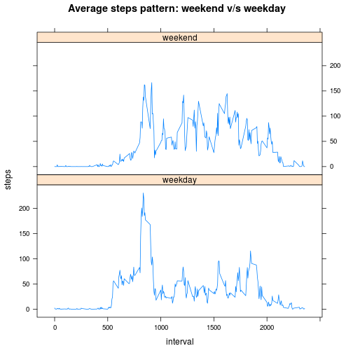

# Reproducible Research: Peer Assessment 1

This assignment is a means to learn about the [knitr](http://yihui.name/knitr/) package with R used to produce markdown and html files with R code embedded which is a great step towards starting a reproducible research.

## Loading and preprocessing the data

For loading the data, we assume that the data is available in the `data` directory at the same level as the markdown file. If it is not, the data should be [downloaded](https://d396qusza40orc.cloudfront.net/repdata%2Fdata%2Factivity.zip) and unzipped in the `data` directory. The unzipped file is named `activity.csv`.


```r
# Path to data
data_file_path <- "data/activity.csv"
if (!file.exists(data_file_path)) {
    stop("Data file not available. Please place the data in `data/activity.csv`")
}
data <- read.csv(data_file_path)
data$date <- as.Date(data$date)
# Check how the data looks
head(data, n = 5)
```

```
##   steps       date interval
## 1    NA 2012-10-01        0
## 2    NA 2012-10-01        5
## 3    NA 2012-10-01       10
## 4    NA 2012-10-01       15
## 5    NA 2012-10-01       20
```


## What is mean total number of steps taken per day?

* The histogram of the data can be plotted using the following piece of code


```r
# Plot histogram of steps wih raw data
with(data, hist(steps, main = "Histogram of steps (Raw data)"))
```

 


* The mean and median of the total number of steps can be calculated as


```r
# Mean number of steps with raw dataset
mean(data$steps, na.rm = TRUE)
```

```
## [1] 37.38
```

```r
# Median number of steps with raw dataset
median(data$steps, na.rm = TRUE)
```

```
## [1] 0
```


## What is the average daily activity pattern?

* Time series plot of the 5-minute interval and the average number of steps taken, averaged across all days


```r
library(data.table)
dt <- data.table(data)
mean_across_days <- dt[, list(mean = mean(steps, na.rm = TRUE)), by = interval]
# Average daily pattern plot
with(mean_across_days, plot(interval, mean, type = "l", main = "Average daily pattern"))
```

 


* Which 5-minute interval, on average across all the days in the dataset, contains the maximum number of steps?


```r
# Interval with max number of steps
mean_across_days[which.max(mean_across_days$mean), ][["interval"]]
```

```
## [1] 835
```


## Imputing missing values

* Calculate and report the total number of missing values in the dataset (i.e. the total number of rows with `NAs`)


```r
# Total NA values
sum(is.na(data))
```

```
## [1] 2304
```


* We devise a strategy for filling in all of the missing values in the dataset. This strategy is simple which assigns the mean for a particular 5-minute interval to the missing data. Note that we have already computed in these values in `mean_across_days`.

* Create a new dataset that is equal to the original dataset but with the missing data filled in (we shall call this `imputed_data`)


```r
imputed_data <- data
na_data <- is.na(imputed_data)
na_intervals <- imputed_data$interval[na_data]
# Make imputed data replacing NAs with 5-minute average
imputed_data[na_data] <- sapply(na_intervals, 
                                function(x) mean_across_days[interval==x,][["mean"]])
# Verify that there is no NA values in the imputed data
sum(is.na(imputed_data))
```

```
## [1] 0
```


The histogram of the steps from the imputed data looks similar to the histogram plot with raw data


```r
# Histogram of steps with imputed data
with(imputed_data, hist(steps, main = "Histogram of steps (Imputed data)"))
```

 

```r
# Mean number of steps with imputed dataset
mean(imputed_data$steps)
```

```
## [1] 37.38
```

```r
# Median number of steps with imputed dataset
median(imputed_data$steps)
```

```
## [1] 0
```


As you can see, the mean and median of the raw and imputed data remains the same.
Now let's look at the number of steps:


```r
# Total steps with raw data
sum(data$steps, na.rm = TRUE)
```

```
## [1] 570608
```

```r
# Total steps with imputed data
sum(imputed_data$steps)
```

```
## [1] 656738
```


As expected, the number of steps for the imputed data is more than the raw data.

## Are there differences in activity patterns between weekdays and weekends?

* Create a new factor variable in the dataset with two levels – “weekday” and “weekend” indicating whether a given date is a weekday or weekend day.


```r
imputed_data$weekdays <- weekdays(imputed_data$date) %in% c('Saturday', 'Sunday')
# Labeling factors as weekday and weekend
imputed_data$weekfactors <- factor(imputed_data$weekdays,
                                   labels=c("weekday","weekend"),
                                   levels=c(FALSE, TRUE))
```


* A panel plot containing a time series plot of the 5-minute interval (x-axis) and the average number of steps taken, averaged across all weekday days or weekend days (y-axis).


```r
dt_imputed <- data.table(imputed_data)

data_to_plot <- dt_imputed[dt_imputed$weekfactors=="weekday",
                           list(steps=mean(steps), weekfactors="weekday"),
                           by=interval]

data_to_plot <- rbind(data_to_plot, 
                      dt_imputed[dt_imputed$weekfactors=="weekend",
                                 list(steps=mean(steps), weekfactors="weekend"), 
                                 by=interval])
# Plot average number of steps for weekend and weekday
library(lattice)
xyplot(steps ~ interval | weekfactors,
       data=data_to_plot,
       type = "l",
       horizontal = TRUE,
       layout=c(1,2),
       main="Average steps pattern: weekend v/s weekday")
```

 

